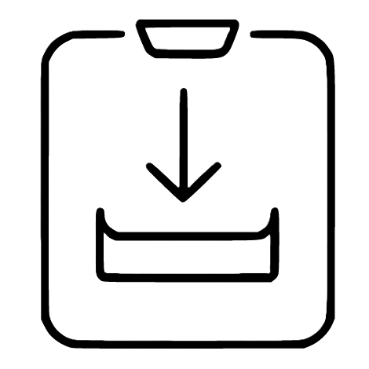

<div align="center">



# SE Downloader

**High-speed, multi-threaded segmented download manager**

[](https://www.gnu.org/licenses/gpl-3.0)
[](https://github.com/SEDET666/SE-Downloader/releases)
[](https://www.python.org/)
[](https://doc.qt.io/qtforpython/)
[](https://qfluentwidgets.com/)
[](https://github.com/)
[](https://developer.chrome.com/docs/extensions/mv3/)
[](https://github.com/)
[](https://github.com/)

English | [中文](#中文说明) | [Русский](#русское-описание)

---


</div>

## ✨ Features

- 🚀 **Multi-threaded segmented download** — up to 64 concurrent threads per task, splits files into segments for maximum speed
- 🔄 **Resume support** — pause and resume downloads at any time; `.seresume` files track per-segment progress
- 📺 **Bilibili (B站) download** — parse BV number or video URL, select quality (up to 4K/1080P with login cookie), auto-merge DASH video+audio with FFmpeg
- 🌐 **Browser extension (MV3)** — intercepts downloads in Chrome & Edge using Content-Disposition / Content-Type heuristics, inspired by NeatDownloadManager
- 🗂️ **Download queue** — configurable concurrent task limit; tasks persist across restarts
- 🎨 **Fluent Design UI** — built with QFluentWidgets; collapsible settings groups; light/dark/system theme; custom accent color reads from Windows registry
- 🌍 **Multi-language** — English, 中文 (Simplified Chinese), Русский; auto-restarts to apply
- 🔒 **Cookie & Proxy support** — per-task or global cookies; HTTP/SOCKS5 proxy; lenient TLS adapter handles CDN SSL quirks
- ⚡ **Global speed limit** — token-bucket algorithm enforces the total rate across all threads
- 📁 **System file icons** — shows the OS icon for each file type using `SHGetFileInfo` (Windows)
- 🖥️ **`seget` CLI** — scriptable command-line downloader with the same engine

## 📦 Installation

### Prerequisites

- Python 3.10 or later
- pip

### Steps

```bash
# 1. Clone the repository
git clone https://github.com/SEDET666/SE-Downloader.git
cd SE-Downloader/se_downloader

# 2. Install dependencies
pip install -r requirements.txt

# 3. Run
python main.py
```

### Browser Extension

1. Open `chrome://extensions` (Chrome) or `edge://extensions` (Edge)
2. Enable **Developer mode** (top-right toggle)
3. Click **Load unpacked**
4. Select the `browser_extension/` folder

The extension requires SE Downloader to be running and listening on the configured port (default **26339**).

## 📺 Bilibili Download

Click the **📺 B站** button next to "New Download" to parse and download Bilibili videos.

### Quality & Login

Without a cookie, the API returns up to **480P** only. To unlock 720P / 1080P / 4K:

1. Log in to bilibili.com in your browser
2. Open DevTools → Application → Cookies → `https://www.bilibili.com`
3. Copy the values of `SESSDATA`, `bili_jct`, and `DedeUserID`
4. In SE Downloader: **Settings → B站** → paste the cookie string:
   ```
   SESSDATA=xxxxxx; bili_jct=xxxxxx; DedeUserID=xxxxxx
   ```

### FFmpeg (required for DASH merge)

Bilibili uses DASH format — video and audio are separate streams that must be merged. SE Downloader will auto-merge with FFmpeg after both streams finish.

If FFmpeg is not installed, click **🔧 自动安装 FFmpeg** in the confirmation dialog. The installer:
1. Fetches the latest release from [GyanD/codexffmpeg](https://github.com/GyanD/codexffmpeg) via [gyan.dev](https://www.gyan.dev/ffmpeg/builds/)
2. Automatically uses a **China mirror** (`github.cnxiaobai.com`) if your IP is in China
3. Extracts `ffmpeg.exe` to `~/.ffmpeg/bin` and adds it to your user PATH
4. Falls back to `winget install ffmpeg` if the direct download fails

## 🖥️ CLI Tool — `seget`

`seget.py` is a standalone command-line downloader using the same segmented engine.

```
Usage: python seget.py <URL> [OPTIONS]

Options:
  -o, --output <name>      Save filename (auto-detected if omitted)
  -d, --dir <path>         Save directory (default: current dir)
  -t, --threads <n>        Thread count (default: 16)
  -r, --retries <n>        Retry count on failure (default: 3)
  --timeout <sec>          Request timeout in seconds (default: 30)
  --speed-limit <KB/s>     Speed cap; 0 = unlimited (default: 0)
  --proxy <url>            Proxy, e.g. http://127.0.0.1:7890
  --cookie <string>        Cookies: key=val; key2=val2
  --referer <url>          Referer header
  --ua <string>            Custom User-Agent
  --no-ssl-verify          Disable SSL certificate verification
  --chs                    Use Chinese interface / 使用中文界面
  -q, --quiet              Suppress progress output
  -h, --help               Show help
```

**Examples:**

```bash
# Basic download
python seget.py https://example.com/file.zip

# Save to ~/Downloads with 32 threads
python seget.py https://example.com/file.zip -d ~/Downloads -t 32

# Speed-limited with proxy
python seget.py https://example.com/video.mp4 --speed-limit 2048 --proxy http://127.0.0.1:7890

# With cookies (e.g. for authenticated content)
python seget.py https://example.com/file.zip --cookie "session=abc123; token=xyz"

# Chinese interface
python seget.py https://example.com/file.zip --chs
```

## 🏗️ Project Structure

```
se_downloader/
├── main.py                      # Entry point — logging, theme, language init
├── seget.py                     # CLI download tool
├── requirements.txt
│
├── core/
│   ├── downloader.py            # SegmentedDownloader engine + LenientSSLAdapter
│   ├── manager.py               # DownloadManager — queue, scheduler, bili pair tracking
│   ├── bili_downloader.py       # Bilibili DASH downloader + FFmpeg merge
│   ├── settings.py              # AppSettings dataclass (JSON, ~/.config/se_downloader/)
│   ├── task_store.py            # Task list persistence across restarts
│   ├── browser_server.py        # Local HTTP server for browser extension
│   └── i18n.py                  # Translations: en_US (default), zh_CN, ru_RU
│
├── ui/
│   ├── main_window.py           # FluentWindow, navigation, browser signal bridge
│   ├── download_queue_page.py   # Download list page with filter tabs
│   ├── download_item.py         # Per-task card widget
│   ├── bili_item.py             # Bilibili task card (video+audio+merge status)
│   ├── bilibili_dialog.py       # B站 parse dialog + FFmpeg auto-install
│   ├── collapsible_group.py     # Collapsible settings group with animation
│   ├── segmented_progress_bar.py# Custom multi-thread progress bar
│   ├── file_icon.py             # System file type icon provider
│   ├── settings_page.py         # Settings with collapsible groups, color picker
│   ├── about_page.py            # About page
│   └── new_download_dialog.py   # New download dialog
│
└── browser_extension/           # MV3 Chrome/Edge extension
    ├── manifest.json            # Manifest V3
    ├── background.js            # Service worker — interception engine
    ├── popup.html / popup.js    # Extension popup UI
    ├── options.html / options.js# Extension settings page
    └── icons/                   # Extension icons (16/48/128 px)
```

## ⚙️ Configuration

Settings are stored in:
- **Windows:** `%USERPROFILE%\.config\se_downloader\settings.json`
- **macOS/Linux:** `~/.config/se_downloader/settings.json`

Debug log: `~/.config/se_downloader/debug.log` (overwritten on each launch)

Key settings:

| Setting | Default | Description |
|---------|---------|-------------|
| `default_save_path` | `~/Downloads` | Default directory for new downloads |
| `default_threads` | `16` | Concurrent threads per task |
| `max_concurrent_downloads` | `3` | Max simultaneous tasks |
| `theme` | `auto` | `auto` / `light` / `dark` |
| `theme_color` | `""` | Hex color; empty = follow system accent |
| `language` | `en_US` | `en_US` / `zh_CN` / `ru_RU` |
| `browser_listen_port` | `26339` | Port for browser extension |
| `browser_integration_enabled` | `true` | Enable browser integration server |
| `global_speed_limit` | `0` | KB/s; 0 = unlimited |
| `bilibili_cookie` | `""` | B站 cookie for HD quality (SESSDATA=...) |

## 🔧 How It Works

### Download Engine

1. **Probe** — sends `HEAD` first (fast, no body), falls back to `GET Range: bytes=0-0` to get file size and check range support
2. **Segmented** — if server supports `Accept-Ranges`, pre-allocates the file and spawns N threads each downloading a non-overlapping byte range
3. **Resume** — progress is saved to `<filename>.seresume` every 3 seconds; on restart, each segment continues from its last written offset
4. **Speed limit** — token-bucket algorithm shared across all threads; total throughput never exceeds the configured cap
5. **Lenient TLS** — custom SSL adapter sets `SECLEVEL=1` to handle CDN SSL quirks like `UNEXPECTED_EOF_WHILE_READING`

### Bilibili Download Flow

```
📺 B站 button
    ↓
Parse BV / URL → bilibili.com API → stream list (quality, video URL, audio URL)
    ↓
Confirmation dialog — shows video URL + audio URL (editable)
    ↓
manager.add_bili_task() → video_task + audio_task in queue
    ↓
Both tasks download independently (up to 8 threads each)
    ↓ (both COMPLETED)
FFmpeg: ffmpeg -i video.m4v -i audio.m4a -c copy output.mp4
    ↓
Temp files deleted, BiliItemWidget shows ✅ 已完成并合并
```

### Browser Interception (MV3)

```
onBeforeRequest    → record requestId, URL
onBeforeSendHeaders → record Referer header
onBeforeRedirect   → track redirect chain, update final URL
onHeadersReceived  → judge by Content-Disposition + Content-Type + extension + file size
                     → mark URL in interceptQueue
downloads.onCreated → cancel() the download, send URL to app via fetch
```

Interception logic is inspired by [NeatDownloadManager](https://www.neatdownloadmanager.com/).

## 🌍 Internationalization

To add a new language:

1. Open `core/i18n.py`
2. Add a new entry to `_STRINGS` with your language code (e.g. `"de_DE"`)
3. Add the code and display name to `SUPPORTED_LANGUAGES`
4. Restart the app — it will appear in Settings → Language

## 📋 Requirements

| Package | Version | Purpose |
|---------|---------|---------|
| `PySide6` | ≥ 6.6.0 | Qt bindings for Python |
| `PySide6-Fluent-Widgets[full]` | ≥ 1.6.0 | Fluent Design UI components |
| `requests` | ≥ 2.31.0 | HTTP download engine |

> **FFmpeg** is required for Bilibili DASH merging. SE Downloader can install it automatically.

## 🤝 Contributing

Contributions are welcome! Please:

1. Fork the repository
2. Create a feature branch (`git checkout -b feature/your-feature`)
3. Commit your changes (`git commit -m 'Add your feature'`)
4. Push to the branch (`git push origin feature/your-feature`)
5. Open a Pull Request

Please make sure new UI strings are added to all three languages in `core/i18n.py`.

## 📄 License

This project is licensed under the **GNU General Public License v3.0**.

See [LICENSE](LICENSE) for the full license text.

---

<div align="center">

## 中文说明

</div>

SE Downloader 是一款高速多线程分段下载管理器，基于 PySide6 + QFluentWidgets 构建，支持 Windows / macOS / Linux。

### 主要功能

- 🚀 最多 64 线程分段下载，充分利用带宽
- 🔄 断点续传，随时暂停/继续
- 📺 **B站视频下载** — 输入 BV 号或链接，选择画质，自动用 FFmpeg 合并 DASH 视频+音频
- 🌐 浏览器扩展（MV3），自动接管 Chrome/Edge 下载
- 🎨 Fluent Design 界面，可折叠设置分组，支持深色/浅色/系统主题及自定义主题色
- 🌍 支持英语、简体中文、俄语
- ⚡ 令牌桶限速，精准控制总带宽占用
- 🔒 自定义 TLS 适配器，解决部分 CDN 的 SSL 握手问题
- 🖥️ `seget` 命令行下载工具（加 `--chs` 使用中文界面）

### 安装

```bash
git clone https://github.com/SEDET666/SE-Downloader.git
cd SE-Downloader/se_downloader
pip install -r requirements.txt
python main.py
```

### B站视频下载

点击下载队列页面右上角的 **📺 B站** 按钮，输入 BV 号或视频链接即可解析。

不登录最高 480P。要解锁高清画质，在 **设置 → B站** 中填写 Cookie（从浏览器 F12 → Application → Cookies → bilibili.com 获取）。

下载完成后自动调用 FFmpeg 合并视频和音频为 MP4。如未安装 FFmpeg，确认对话框中有一键自动安装按钮。

### 浏览器扩展安装

1. 打开 `chrome://extensions`（Chrome）或 `edge://extensions`（Edge）
2. 开启右上角「开发者模式」
3. 点击「加载已解压的扩展程序」
4. 选择 `browser_extension` 文件夹

---

<div align="center">

## Русское описание

</div>

SE Downloader — высокоскоростной многопоточный менеджер загрузок, построенный на PySide6 + QFluentWidgets. Работает на Windows, macOS и Linux.

### Основные возможности

- 🚀 До 64 потоков на задачу, сегментная загрузка для максимальной скорости
- 🔄 Возобновление загрузки — пауза и продолжение в любой момент
- 📺 **Загрузка с Bilibili** — разбор BV-номера или ссылки, выбор качества, автослияние DASH видео+аудио через FFmpeg
- 🌐 Расширение для браузера (MV3) — перехват загрузок Chrome и Edge
- 🎨 Интерфейс Fluent Design со сворачиваемыми группами настроек
- 🌍 Поддержка английского, китайского и русского языков
- ⚡ Алгоритм токен-бакет для точного ограничения скорости по всем потокам
- 🔒 Адаптер TLS с пониженным уровнем безопасности для совместимости с CDN

### Установка

```bash
git clone https://github.com/SEDET666/SE-Downloader.git
cd SE-Downloader/se_downloader
pip install -r requirements.txt
python main.py
```

---

<div align="center">

Made with ❤️ using [PySide6](https://doc.qt.io/qtforpython/) and [QFluentWidgets](https://qfluentwidgets.com/)

</div>
